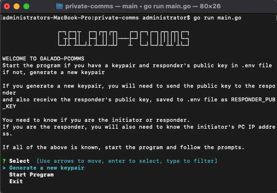

# Private Comms
This is a personal project to create a private communication system between 2 remote PCs through the terminal. It is not intended for public use.

## How to use
Note: You must have the responder's generated public encoded key (in string) to use this program. This is to ensure message authenticity.

1. Clone the repository
```bash
git clone https://github.com/galadd/private-comms.git
```
3. Run the program
```bash
private-comms/private-comms
```
If you generate a new keypair, create an additional key, "RESPONDER_PUB_KEY", in the .env file and set it to the encoded public key of the responder. 

4. Follow the program prompts
```bash
private-comms/private-comms
# Select `Start Program`
```

5. It's imprtant to know the order, and both parties are aware
Responder can not connect if the Initiator has not run the program first.

## How to generate a new keypair
1. Run the program
```bash
private-comms/private-comms
```

2. Select `Generate New Keypair`

## Outlook of .env file
```makefile
# .env
# This file is used to store environment variables
# The first 2 variables are autogenerated when you generate a new keypair
HEX_ENCODED_PUBLIC= # The public key encoded in hex
HEX_ENCODED_PRIVATE= # The private key encoded in hex

# The last variable is obtained from the responder outside of this program for security reasons
RESPONDER_PUB_KEY= # The responder's public key encoded in hex
```

<p align="center" width="100%">
 
</p>
Image: The program in action
</br>

## How it works
The program uses the RSA algorithm to generate a keypair and sign/verify messages. The program uses AES-256 to encrypt/decrypt messages. The program uses the Diffie-Hellman key exchange algorithm to generate a shared secret key. This is the key used by AES-256 to encrypt/decrypt messages. 

## Future plans
- [ ] Add a way to send messages to multiple people
